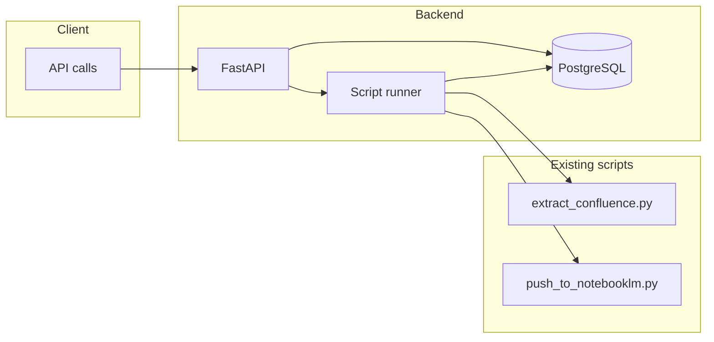

# Phase 2: Backend API — Spec and Implementation Plan

## Scope (from roadmap)

- **FastAPI backend + PostgreSQL** for script management and persistence.
- **Trigger scripts** separately or in chain: Confluence export, then (optionally) NotebookLM push.
- **Persist:** run history (when each operation ran, success/failure) and list of files downloaded/exported.

## Architecture

- Backend invokes existing `extract_confluence.py` and `push_to_notebooklm.py` via subprocess (or async subprocess). No changes to script interfaces; config via env and CLI args.
- Run history and file list are written by the backend after each run (parsing script output or reading export dir/manifest).

---

## Task 1: Save spec documentation

Create `agent-os/specs/2026-02-24-1500-backend-api/` with:

- **plan.md** — This plan (full task list and architecture).
- **shape.md** — Shaping notes: scope (Phase 2 Backend API), decisions (subprocess invocation, persist after run), context (no visuals, no codebase references; product alignment from roadmap).
- **standards.md** — Relevant standards: backend/api, backend/models, backend/migrations, global/error-handling. Include full content of each.
- **references.md** — Pointers: existing scripts as integration targets; tech-stack for FastAPI + PostgreSQL.
- **visuals/** — Empty (no visuals provided).

---

## Task 2: Backend project layout and dependencies

- Add backend app directory (e.g. `backend/`) with FastAPI app entrypoint, router layout, and config (env for DB URL, Confluence/NotebookLM env pass-through).
- Add dependencies: `fastapi`, `uvicorn`, PostgreSQL driver (`asyncpg` or `sqlalchemy` + async), `pydantic-settings`. Pin in requirements or dedicated `backend/requirements.txt`.
- Document in README how to run the API locally and required env vars.

---

## Task 3: Database models and migrations

- Define models for:
  - **Run / job execution:** id, script name (e.g. `confluence_export`, `notebooklm_push`), started_at, finished_at, status (success/failure), optional log or error message, optional parent_run_id for chained runs.
  - **Exported files:** id, run_id (FK), path or name, optional size/checksum; populated after Confluence export (e.g. from `confluence_export/manifest.json`).
- Add reversible migrations: initial schema, clear naming, separate schema from data if needed.
- Use timestamps and constraints per backend/models standard.

---

## Task 4: API endpoints

- **POST /runs** (or **POST /jobs**) — Trigger one or both scripts (body: e.g. `{"scripts": ["confluence_export"]}` or `["confluence_export", "notebooklm_push"]` for chain). Return 202 with run id(s); run scripts asynchronously (background task or worker), persist run start.
- **GET /runs** — List run history with query params: pagination, optional filter by script/status. Return list of runs with id, script, started_at, finished_at, status.
- **GET /runs/{id}** — Single run details (including log/error if stored).
- **GET /files** (or **GET /runs/{id}/files**) — List exported files (from DB and/or latest export dir). If from DB, filter by run_id or "latest run".
- **GET /health** — Liveness/readiness (DB connectivity).
- Follow backend/api standard: RESTful resource names, plural nouns, appropriate status codes (200, 201, 202, 400, 404, 500), optional version prefix (e.g. `/api/v1`).

---

## Task 5: Script runner integration

- Implement runner that invokes `extract_confluence.py` and `push_to_notebooklm.py` with correct args and env (Confluence URL/user/pass, NotebookLM auth dir, export dir). Use subprocess (or asyncio subprocess); capture stdout/stderr and exit code.
- On finish, update run record: status (success/failure), finished_at, optional error message. For Confluence export, parse `confluence_export/manifest.json` and insert/update exported-files records linked to run_id.
- Centralized error handling and logging per global/error-handling standard.

---

## Task 6: Chained run and tests

- Ensure chained run (Confluence export then NotebookLM push) passes export dir and manifest from first script to second; only start push after export run succeeds.
- Add pytest tests: (1) API endpoint tests (e.g. trigger run, list runs, list files) with mocked runner or DB; (2) optional integration test with real subprocess calls in CI if feasible.

---

## Summary

| Task | Description                                                             |
| ---- | ----------------------------------------------------------------------- |
| 1    | Save spec folder (plan, shape, standards, references, visuals/)         |
| 2    | Backend layout, FastAPI app, dependencies, README                       |
| 3    | DB models (runs, exported files) and reversible migrations              |
| 4    | REST endpoints: trigger runs, list runs, run detail, list files, health |
| 5    | Script runner (subprocess, env, persist run + file list)                |
| 6    | Chained run logic and tests                                             |
